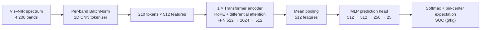

# CrossSOC: Compact differential spectral modeling for efficient and reliable soil organic carbon prediction across regions

CrossSOC predicts soil organic carbon (SOC) from 4,200-band Vis–NIR spectra. The default model is **X2B**; `Main/architecture.py` defines the network, and `Main/experiments.py` lists the reference and ablation configurations.

## Model architecture

X2B first normalizes each spectral band, then uses a three-layer 1D CNN to produce 210 tokens at a stride of 20 bands. A single bidirectional Transformer encoder layer applies RoPE-based differential attention (4 output heads, head dimension 128) and a `512 → 1024 → 512` feed-forward network. Mean pooling and a `512 → 512 → 256 → 25` prediction head produce SOC-bin logits. The SOC prediction is the probability-weighted mean of the bin centers; bin boundaries are computed from the training fold.

The X1 reference uses a shared MLP tokenizer (10 bands per token, 420 tokens), width 1024, and a `1024 → 4096 → 1024` encoder FFN. Both configurations use one encoder layer and a nominal 25-bin output.

## Dependencies and environment

- Python 3.10 or newer; dependencies in [`requirements.txt`](requirements.txt): NumPy ≥1.24, pandas ≥2.0, SciPy ≥1.10, scikit-learn ≥1.3, and PyTorch ≥2.5.
- CPU is supported. Full training is intended for CUDA; the default CUDA training path uses bfloat16 autocast, so a compatible GPU is needed. Disable autocast with `--no-amp` on other GPUs.
- PyTorch SDPA and the pure-PyTorch RoPE implementation are the default fallback. FlashAttention and xFormers are optional attention backends. Triton is optional and used only when `CROSSSOC_ROTARY=triton` is set on CUDA.

Install the packages with `pip install -r requirements.txt` using a PyTorch build appropriate for your CPU or CUDA runtime.
